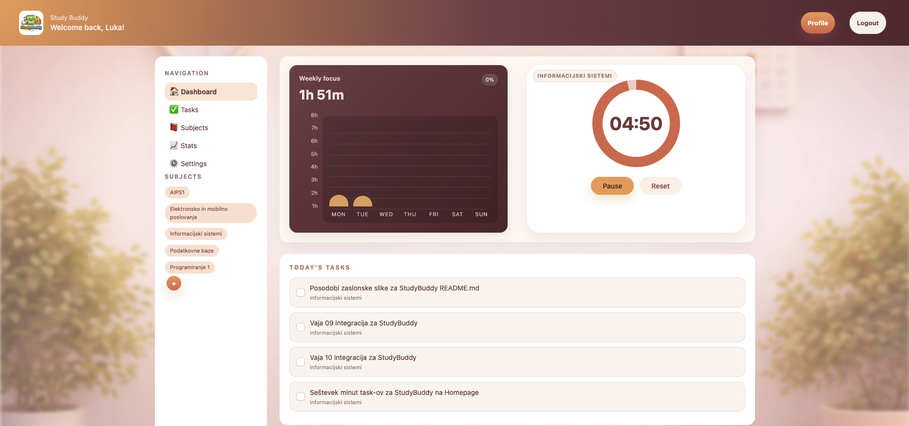
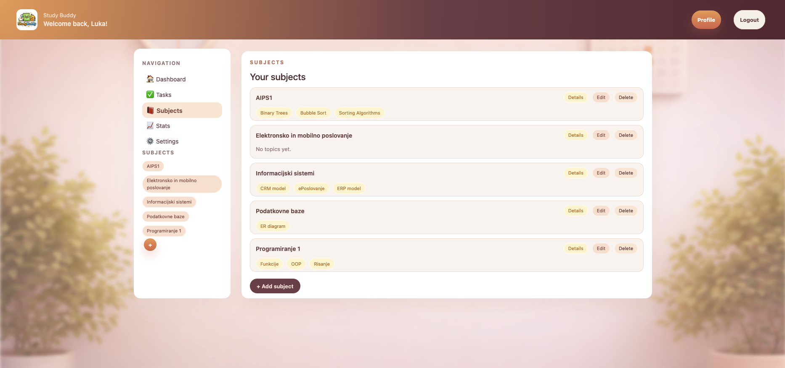
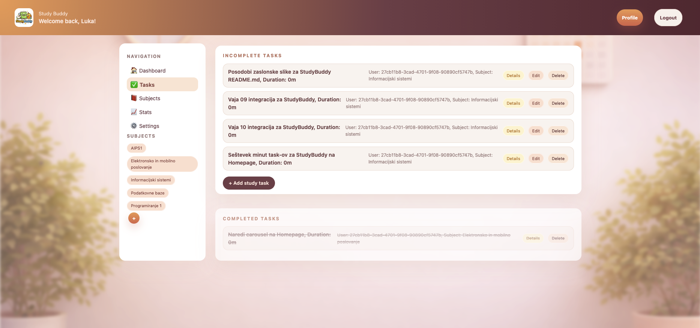
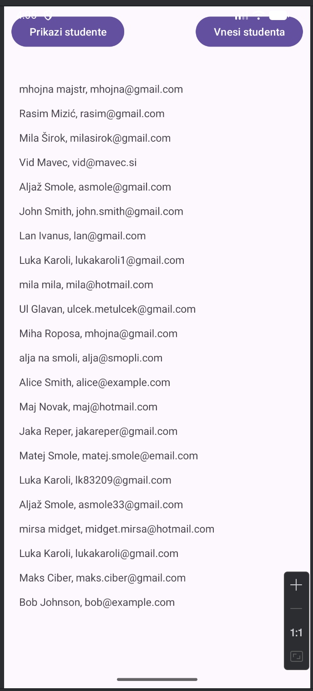
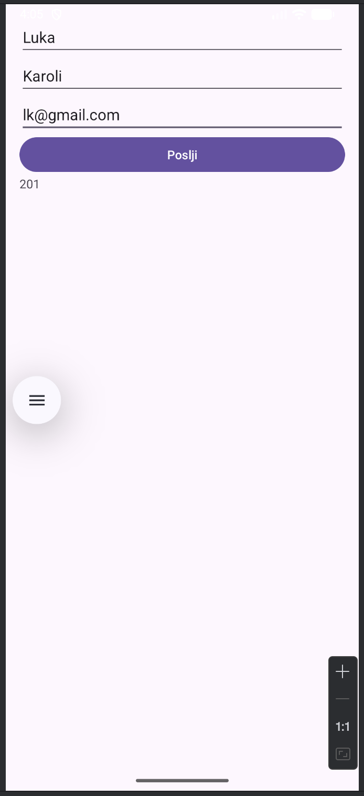

# StudyBuddy

🔗 **Spletna aplikacija:**  
https://studybuddy-cma0h0bnc5dbckfu.germanywestcentral-01.azurewebsites.net

---

## Avtorja

- **Luka Karoli** (vpisna št.: 63240138)  
- **Aljaž Smole** (vpisna št.: 63240293)

---

## Opis sistema

StudyBuddy je spletna aplikacija za podporo samostojnemu učenju in pripravi na izpite. Namen sistema je uporabnikom omogočiti bolj organizirano, pregledno in učinkovito učenje s pomočjo strukturiranja učnih vsebin, ter odstraniti nepotrebne moteče faktorje med učenjem. Aplikacija je namenjena tudi tistim, ki samo radi spremljajo kaj in koliko časa so porabili na neki zadevi (npr. projektu).
Uporabnik lahko:
- ustvari **predmete (Subjects)** in znotraj njih **teme (Topics)**,
- sestavlja **kvize (Quizzes)**, ki so sestavljeni iz različnih vprašanj,
- beleži **študijske seje (Study sessions)**, kjer se shranjujejo podatki o trajanju učenja, času in obravnavanih temah.

Na podlagi zbranih podatkov lahko uporabnik analizira svoje učne navade (**podstran Stats**) in spremlja, koliko časa posveča posameznim predmetom. Sistem tako združuje organizacijo učne snovi, aktivno ponavljanje in preverjanje znanja na enem mestu.

---

## Zaslonske slike aplikacije

### Spletna aplikacija

### Mobilna aplikacija

  
  

## Podatkovni model

Spodaj je prikazan podatkovni model podatkovne baze, ki prikazuje glavne entitete sistema in njihove povezave.

### Opis entitet

- **User** – uporabnik sistema
- **Subject** – učni predmet, ki pripada uporabniku
- **Topic** – tema znotraj posameznega predmeta
- **Quiz** – kviz, sestavljen iz več vprašanj
- **Question** – posamezno vprašanje v kvizu
- **StudySession** – beleženje časa in trajanja učenja
- **StudyTask** - učna naloga, omogoča spremljanje izvedbe le-teh

---

## Razdelitev dela med študenta

### Aljaž Smole
- zasnova in implementacija podatkovnega modela,
- razvoj backend logike (API, povezava z bazo),
- implementacija beleženja študijskih sej,
- postavitev Azure SQL baze in Azure Web App okolja,
- integracija aplikacije z oblačnimi storitvami.

### Luka Karoli
- razvoj uporabniškega vmesnika (spletna aplikacija),
- implementacija upravljanja predmetov, uporabnikih podatkov, prikaz statistike o učenju,
- implementacija kvizov in vprašanj,
- oblikovanje uporabniške izkušnje (UX).

Pri zasnovi aplikacije (idejna zasnova, podatkovni model, izbira uporabljene infrastrukture in tehnologij) sva odločitve sprejemala skupaj v okviru vaj pri predmetu. Velik del funkcionalnosti sva tudi implementirala skupno že med samimi demonstracijami na vajah, vključno z razvojem REST API-ja, uporabo oblačne infrastrukture ter povezavo s podatkovno bazo.

Kljub delitvi nalog sva pri razvoju aplikacije tesno sodelovala. Jaz, Luka Karoli, sem se v večji meri osredotočil na razvoj uporabniškega vmesnika (front-end), medtem ko se je Aljaž Smole pretežno ukvarjal z razvojem strežniškega dela aplikacije (back-end). Vendar pa razvoj ni potekal povsem ločeno, saj je delovanje sistema zahtevalo dobro razumevanje obeh plasti.

---

## Uporabljene tehnologije

- **.NET 10**
- **ASP.NET Core (MVC / API)**
- **Azure SQL Database**
- **Azure Web App**
- **Entity Framework Core**
- **GitHub**
- **Umetna inteligenca** (ideje za različne funkcionalnosti aplikacije, vizualna vsebina, ...)

---
